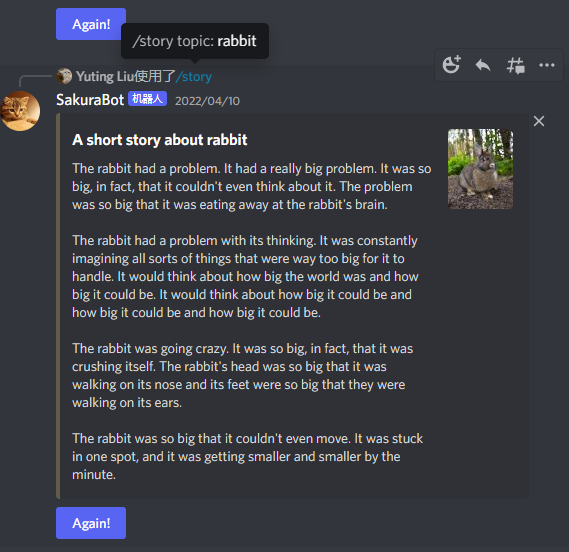
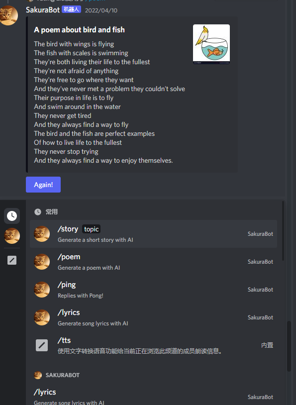

# Discord literary bot

[Test in Discord APP!](https://discord.com/channels/883045046029516880/892810995657998396)
## What's this?
- This is a creative robot that can write poems or stories and so on, inspired by [aspensykes/storycord](https://github.com/aspensykes/storycord).

## Function
- Add to any discord channel (requires admin rights)
- Create an interactive command in a channel
- Generate lyrics, poems and stories based on user input

## Technical details
- Using discord.js library to run a Server, create a 'interaction command' listener and response
- Using natural language processing library- OpenAI to generate literature
- Using google custom search engine to fetch image by user input

## Generator poem, lyric or story
When a member of a channel uses the /poem, /lyric or /story command, the server will recognize this command and execute the code in poetry.js in order:

1.Replace illegal characters in command text

2.Call the openai interface, ask it to generate a text, and pass in the command text

3.Call the google search interface, pass in the command text, and get a related picture

4.Generate objects according to the format required by discordjs and send back to the discord channel

## How to use
- First, you should create an .env file to save your token or api keys. Include

- DISCORD_CLIENT_ID=your Discord bot user ID

- DISCORD_TOKEN=your Discord bot user token

- OPENAI_SECRET=your OpenAI API secret token

- GCS_API_KEY=your Google Custom Search API key

- GCS_PROJECT_CX=your Google Custom Search search engine ID (aka CX)

Then, cd in root directory, run `npm install` to install all dependencies, use `node index.js` to run it!

After it run, if you add the bot in your discord, you can use `/story`, `/poem`, `/lyrics` or `/ping` to activate te bot!
## License
This project uses the MIT License. [Learn  more about the conditions of the license here.](/LICENSE)
